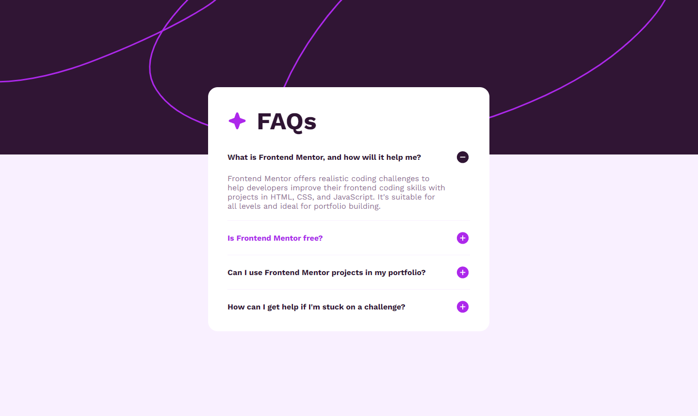

# Frontend Mentor - FAQ accordion solution

This is a solution to the [FAQ accordion challenge on Frontend Mentor](https://www.frontendmentor.io/challenges/faq-accordion-wyfFdeBwBz). Frontend Mentor challenges help you improve your coding skills by building realistic projects. 

## Table of contents

- [Overview](#overview)
  - [The challenge](#the-challenge)
  - [Screenshot](#screenshot)
  - [Links](#links)
- [My process](#my-process)
  - [Built with](#built-with)
  - [What I learned](#what-i-learned)
  - [Continued development](#continued-development)
- [Author](#author)

## Overview

### The challenge

Users should be able to:

- Hide/Show the answer to a question when the question is clicked
- Navigate the questions and hide/show answers using keyboard navigation alone
- View the optimal layout for the interface depending on their device's screen size
- See hover and focus states for all interactive elements on the page

### Screenshot

### Links

- Live Site URL: [FAQ Accordian](https://rkendall300.github.io/faq-accordian/)

## My process

### Built with

- Semantic HTML5 markup
- CSS custom properties
- Flexbox
- Mobile-first workflow
- [React](https://reactjs.org/) - JS library

### What I learned

This project was a little strange for me. I originally picked it up as my first Frontend Mentor project, and got the functionality down but had several problems with styling the page. Going from desktop to mobile caused problems with scaling, the background image was not doing what I wanted it to and I didn't know how to fix it. I came back to this project about two weeks later after I'd done several other projects and felt I could handle it a lot better. Unfortunately, I was not able to use React states in an efficient way, and I went with the same functionality I had written previously, which is a bit messy. I'm not entirely sure the accordian works as it should from the design pictures, but I don't know how else I would do it. If anyone has any suggestions on a different kind of functionality, please let me know. 

### Continued development

I would happily come back to this project after getting more used to React so I could implement a few extra details.

## Author

- Frontend Mentor - [@rkendall300](https://www.frontendmentor.io/profile/rkendall300)